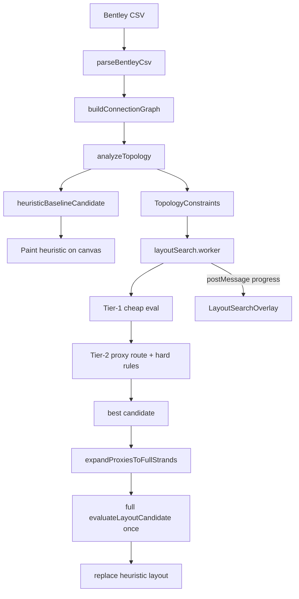

# Import performance + progress UX — build plan

> **Status (2026-06-28):** P0 **shipped** (worker + overlay + heuristic paint). P1–P4 pending. Builds on routing-first search (Phases 1–6 in [`ROUTING_FIRST_LAYOUT.md`](./ROUTING_FIRST_LAYOUT.md)).
>
> **Problem:** Optimized import runs ~2000 full candidate evaluations on the **main thread**. Large CSVs take minutes; the browser shows “page unresponsive” dialogs; the overlay only updates between rounds so it feels frozen.
>
> **Frozen:** `.cursor/rules/frozen-routing.mdc` — search may **call** frozen routing APIs; proxy/fast paths must not edit frozen symbols without user approval.

## Goals

| Goal | Success |
|------|---------|
| **Faster** | Large symmetric splices (e.g. two 144s) import in seconds–tens of seconds, not minutes |
| **Responsive** | No main-thread long tasks; no browser “wait or close” dialogs |
| **Trustworthy UX** | User sees continuous progress, phase labels, and proof the optimizer is working |
| **Accurate** | Same hard-rule pass rate on reference CSVs; deterministic (fixed seed) |
| **No new deps** | Web Workers + existing stack only |

## Architecture (target)



## New module: `src/features/layoutSearch/topology/`

| File | Role |
|------|------|
| `analyzeTopology.ts` | One-pass graph stats after `buildConnectionGraph` |
| `topologyTypes.ts` | `CableAffinity`, `TopologyConstraints`, confidence scores |
| `deriveConstraints.ts` | Lock opposite sides, hub/satellite roles, proxy groups |
| `analyzeTopology.test.ts` | Unit tests on synthetic + example-2 graphs |

### Topology signals (computed once per import)

| Signal | Source | Use |
|--------|--------|-----|
| **Cable pair affinity** | Count fiber connections A↔B vs total per cable | Lock high-confidence opposite sides |
| **Dominant pair** | Reuse `findDominantCablePair` | Seed + lock anchor cables |
| **Same-side pair rate** | Per cable-pair from graph | Reject candidates that violate low same-side rate |
| **Hub vs satellite** | Connection degree per cable | Search only mutates satellites |
| **Homogeneous tube bundles** | Same tube → same destination cable (all fibers) | Proxy-route group in tier-2 |
| **Through / mid-span** | `isThroughCable`, from+to legs | Lower lock confidence; never hard-lock |

### Confidence thresholds (initial — tune on fixtures)

```ts
// illustrative defaults
LOCK_OPPOSITE_MIN_AFFINITY = 0.75   // e.g. 120/144 strands between A↔B
LOCK_OPPOSITE_MIN_COUNT = 24        // ignore locks on tiny splices
PROXY_BUNDLE_MIN_SIZE = 4           // route 1 rep when N+ fibers share tubeBundleKey topology
```

Locked constraints **narrow mutations**, not final accuracy — winning candidate still gets full per-strand route + rules once.

---

## Phased delivery

### Phase P0 — Progress UX + main-thread relief ✅ shipped 2026-06-28

**Why first:** Fixes “frozen browser” even before search gets faster. Highest user impact per day.

| Task | Detail |
|------|--------|
| **Web Worker** | `layoutSearch.worker.ts` — runs `layoutSearch` + `evaluateLayoutCandidate` off main thread. Main thread: parse CSV, topology (light), paint heuristic, receive progress, apply winner. |
| **Worker bridge** | `layoutSearchClient.ts` — `postMessage` with typed protocol: `progress`, `done`, `error`, `cancel`. Transfer nothing heavy; clone `ConnectionGraph` once via structured clone. |
| **Heartbeat progress** | Worker posts progress **every evaluation** (or every 50ms wall clock, whichever is sooner) so UI updates during long brute-force stretches. |
| **Rich overlay** | Extend `LayoutSearchProgress` + `LayoutSearchOverlay`: phase label, determinate bar (`evaluations / budget`), elapsed time, evals/sec, strand/cable counts, feasibility badge, subtle activity animation. |
| **Progressive paint** | After parse: immediately `buildCanvasFromCandidate(heuristicBaseline)` so canvas is live while worker searches; swap on `done`. Cancel → keep best-so-far or heuristic. |
| **Phase labels** | `analyzing` → `optimizing` → `finalizing` — map to worker messages. |

**Gate:** `npm run smoke`; manual QA — import example-2 + a large Left CSV; confirm overlay animates continuously and no “page unresponsive” dialog within 30s of import start.

**Files:** `layoutSearch.worker.ts`, `layoutSearchClient.ts`, `LayoutSearchOverlay.tsx`, `WorkflowCanvas.tsx`, `layoutSearch.ts` (extract serializable core).

---

### Phase P1 — Topology constraints (search-space pruning)

| Task | Detail |
|------|--------|
| `analyzeTopology` | Build cable×cable connection matrix, affinity ratios, hub ranking. |
| `deriveConstraints` | Output `lockedCableSides`, `forbiddenSameSidePairs`, `searchableCables`, `dominantPairLock`. |
| **Constrain mutations** | `pickMutation` / `randomCandidate` in `layoutSearch.ts` respect locks — only flip/search satellite cables. |
| **Constrain enumeration** | Brute-force path skips side encodings that violate locks. |
| **Seed boost** | Baseline candidate must satisfy locks; if not, force dominant pair opposite before search. |

**Gate:** `analyzeTopology.test.ts` + `layoutSearch.test.ts` — example-2 locks two dominant 144s opposite; search eval count drops ≥50% vs unconstrained on synthetic hub fixture.

---

### Phase P2 — Tiered evaluation (CPU reduction)

Three tiers inside worker; promote survivors only.

| Tier | Work | Purpose |
|------|------|---------|
| **T0 — placement** | Side/stack/width valid vs constraints; stack-crossing estimate (reuse `stackCrossingsForOrders` logic, no grid) | Discard obviously bad candidates cheaply |
| **T1 — proxy route** | Route one strand per homogeneous `tubeBundleKey` + one per unlocked cable-pair edge; analytic 24px offsets for siblings | ~N× fewer lane solves |
| **T2 — full** | Current `evaluateLayoutCandidate` (all strands, all rules) | Only top-K per restart window + plateau candidates |

Flow: every candidate → T0 → (pass) T1 → (pass) T2. Track tier in progress UI (“quick check” vs “full route”).

**Gate:** Reference fixtures still find feasible layouts; crossing/bend scores ≤ current best on example-2; median eval wall time ↓ ≥40% on synthetic two-144 fixture.

**Accuracy guard:** Final winner always runs **one** full T2 eval on main thread or worker before paint swap (skip duplicate if worker already ran T2 on winner).

---

### Phase P3 — Memoization + budget tuning

| Task | Detail |
|------|--------|
| **Candidate memo** | Cache `candidateStableId → score` inside search; skip re-eval. |
| **Skip duplicate final eval** | If winner’s last eval was T2, reuse result in `WorkflowCanvas` post-search path. |
| **Import time budget** | Wire `timeBudgetMs` on import (e.g. 90s default, scale with strand count); always return best-so-far. |
| **Adaptive rounds** | Lower `maxRounds` when topology locks leave small search space; keep plateau exit. |

**Gate:** `npm run smoke`; no regression on determinism test (same CSV → same layout).

---

### Phase P4 — Parallel worker pool (optional)

Only if P0–P3 insufficient on largest production CSVs.

| Task | Detail |
|------|--------|
| Pool of 2–4 workers | Partition guided-search restarts by seed offset; merge best candidate. |
| Shared cancel | Broadcast cancel to all workers. |

**Gate:** Large fixture wall time ↓ vs single worker; determinism preserved per fixed pool config.

---

## Progress UI spec

### `LayoutSearchProgress` (extended)

```ts
type LayoutSearchPhase =
  | "parsing"
  | "analyzing"
  | "heuristic_paint"
  | "optimizing"
  | "finalizing";

type LayoutSearchProgress = {
  phase: LayoutSearchPhase;
  round: number;
  evaluations: number;
  evaluationBudget: number;      // maxRounds or derived cap
  bestScore: number;
  feasible: boolean;
  elapsedMs: number;
  evalsPerSecond?: number;
  strandCount: number;
  cableCount: number;
  lockedCableCount?: number;
  currentTier?: "T0" | "T1" | "T2";
  message?: string;               // human line, e.g. "Routing 288 fibers…"
};
```

### Overlay content

- **Title:** phase-driven (“Analyzing connections…”, “Optimizing layout…”, “Finishing…”)
- **Progress bar:** determinate when `evaluationBudget` known; pulse animation during `finalizing`
- **Stats row:** round · evals · elapsed · evals/sec
- **Feasibility chip:** hidden until feasible, then green “Feasible layout found”
- **Cancel:** unchanged — apply best-so-far
- **a11y:** `role="status"`, `aria-live="polite"`, `aria-valuenow` on bar

### Browser unresponsive mitigation

| Technique | Phase |
|-----------|-------|
| Worker runs all search eval | P0 |
| Main thread only paints + message handler | P0 |
| Heuristic visible immediately | P0 |
| `timeBudgetMs` cap | P3 |

---

## Testing

| Gate | When |
|------|------|
| `npm run smoke` | Every phase |
| `analyzeTopology.test.ts` | P1 |
| `layoutSearch.test.ts` extensions | P1–P3 (constraint + memo + tier promotion) |
| Synthetic two-144 perf fixture | P2 — assert eval count + wall time budget in test |
| Manual QA | Every phase — example-2, Left-SP-3254.5, largest available Left CSV |
| `npm run test:rules` | **Only when user requests** — after P2 stable |

Add perf fixture CSV or synthetic graph builder in `src/features/layoutSearch/fixtures/` (no new npm deps).

---

## Risks

| Risk | Mitigation |
|------|------------|
| Proxy routing misses per-strand violations | Full T2 on winner only; spot-check reference CSVs |
| Over-aggressive locks on weird CSVs | Confidence thresholds + never lock through cables without review |
| Worker clone cost on huge graphs | Clone once; topology analysis on main thread before handoff |
| Progressive paint flash | Cross-fade or keep overlay until final swap; same viewport |
| Determinism drift | Fixed seed; stable tie-breaks; document pool config if P4 |

---

## Out of scope (this plan)

- Editing frozen routing symbols (`spliceEdgeRouting.ts`, drag wiring)
- New npm packages (e.g. Comlink) unless user approves
- `npm run test:rules` as default gate
- PDF/export perf

---

## Suggested implementation order

1. **P0** — worker + rich overlay + heuristic-first paint *(unblocks UX immediately)*
2. **P1** — topology locks *(big search-space win on symmetric splices)*
3. **P2** — tiered eval + proxy bundles *(big CPU win)*
4. **P3** — memo + budgets + skip duplicate final eval
5. **P4** — worker pool if needed

## First session checklist

1. Add `layoutSearch.worker.ts` + client bridge; wire `WorkflowCanvas` import path.
2. Extend `LayoutSearchProgress` + overlay (bar, elapsed, phase).
3. Paint `heuristicBaselineCandidate` before `layoutSearchAsync`.
4. `npm run smoke` + manual QA on example-2.
5. Do **not** touch frozen routing symbols.
