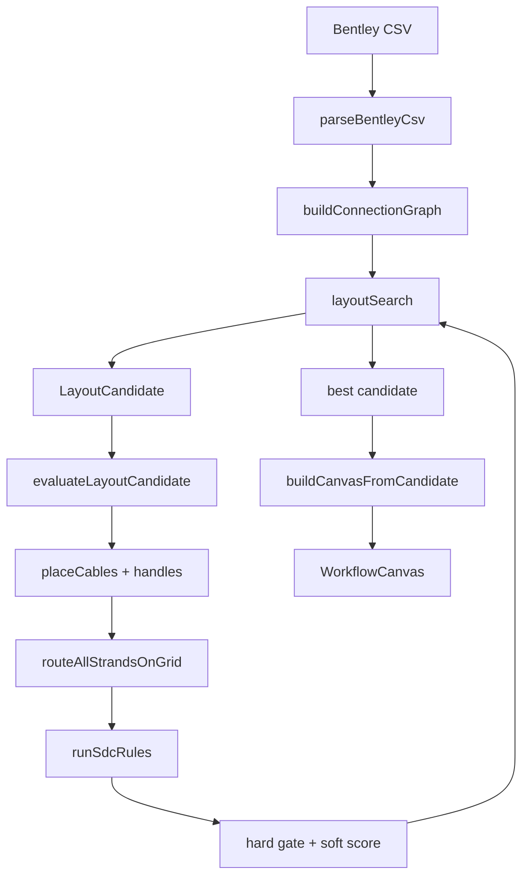

# Routing-first auto layout — build plan

> **Status (2026-06-27):** Approved direction. Auto import picks the best layout; no 2-side / 4-side user toggle.
>
> **Supersedes for auto placement:** side heuristics in `computeCableCanvasSides`, `computeCanvasPlacement` barycenter flow, and the horizontal vs quad **mode fork** on import. Quad remains a reference for 4-edge geometry until unified engine lands.
>
> **Frozen:** `.cursor/rules/frozen-routing.mdc` — search **calls** routing; does not edit frozen symbols without user approval.

## Product intent

On CSV import, the app runs a long search that:

1. Tries many cable placements (sides, stack order, canvas size).
2. Routes **every fiber strand** on the internal grid.
3. Scores the result against **all SDC rules**.
4. Paints the **best feasible** layout on the canvas.

**No layout mode picker.** Two-sided diagrams are a valid *outcome*, not a user setting. Top/bottom sides are used only when routing score needs them.

Manual drag of cables to any side is **out of scope for v1** — planned after auto search is stable (SDC-UX-001 locks).

## Principles

| Principle | Meaning |
|-----------|---------|
| **Routing decides placement** | Cable sides and stack order are search outputs, not upstream heuristics. |
| **Four sides available, none required** | Each cable may land on left, right, top, or bottom; unused edges stay empty. |
| **Rules are hard gates + soft score** | P0/P1 violations reject a candidate; P2–P4 and aesthetics pick among feasible layouts. |
| **Slow is OK on import** | Target 1,000–5,000 candidate evaluations per import (configurable). |
| **Deterministic** | Fixed RNG seed + stable tie-breaks → same CSV → same layout. |
| **Simple splices stay simple** | Soft penalty for using extra sides when scores tie. |

## User vocabulary (simple terms)

See [`SIMPLE_TERMS.md`](./SIMPLE_TERMS.md). Optimizer optimizes:

- **Handle** positions (from cable placement + fiber row pitch).
- **Left leg / right leg** paths and **corners** (bend budget = 2 total).
- **Tube bundle** shared runs and **center nest** stagger.
- **Row order** and **fiber order** inside tubes (fixed by SDC-ORDER; not permuted in search v1).

## Architecture



### New module: `src/features/layoutSearch/`

| File | Role |
|------|------|
| `layoutCandidate.ts` | Encodes per-cable side (L/R/T/B), stack index on that side, `layoutWidth`, `layoutExpansion` |
| `evaluateCandidate.ts` | Build nodes/edges → grid route → rule context → `{ feasible, score, violations }` |
| `layoutSearch.ts` | Search loop (seed, mutate, hill-climb, restarts); returns best candidate |
| `candidateToGraph.ts` | Apply winning candidate to placement + React Flow graph |
| `layoutScorer.ts` | Composite soft score + `SDC-SCORE-001` weights (document in rule pack) |
| `layoutSearch.test.ts` | Brute-force oracle on tiny fixtures; regression on reference CSVs |

**Do not rewrite** `spliceEdgeRouting.ts` frozen symbols. Evaluation calls existing `routeAllOnGrid`, `buildSpliceHandleEntries`, `attachPrecomputedPaths`, and SDC rule runners.

### Unified render path (replaces mode fork on import)

Today: `buildReactFlowGraph` early-returns to `buildQuadReactFlowGraph` when `layoutMode === "quad"`.

Target: **one builder** driven by candidate side assignment:

- Cables on **left/right** — existing horizontal breakout geometry.
- Cables on **top/bottom** — quad geometry (`orientTubesForQuadSide`, `quadRenderTransform`) reused as **render adapters**, not a separate import pipeline.
- Routing uses grid with `layoutMode` derived from which sides are populated (horizontal channel vs quad frontiers — see `gridMap.ts`).

`layoutMode` toolbar toggle: **removed from import path**; field may remain in saved config for backward compat until migration.

## What each candidate controls

| Knob | Search? | Notes |
|------|---------|-------|
| Per-cable side (L/R/T/B) | **Yes** | Core search dimension |
| Stack order per side | **Yes** | Permute / swap / anneal |
| Canvas width | **Yes** | Steps from content min → viewport fill → expanded |
| `layoutExpansion` (center/cable/tube gaps) | **Yes** | Absorbs `resolveFeasibleImportLayout` loop |
| Row order inside diagram | **No (v1)** | Keep `connectionsInRowLayoutOrder` + dominant pair |
| TIA fiber/tube order inside cable | **No** | SDC-ORDER hard constraint |
| CSV data / pair graph | **No** | SDC-DATA hard constraint |

## Scoring model

Align with [`RULE_PRIORITY.md`](./RULE_PRIORITY.md) and [`splice_detail_canvas_rule_pack/00_Rule_Index.md`](../splice_detail_canvas_rule_pack/00_Rule_Index.md).

### Tier 1 — Reject candidate (`feasible: false`)

Run full rule set (or import + route + layout subset) via `buildSdcRuleContext` + `runRules`:

- `SDC-DATA-001`, `SDC-DATA-002`
- `SDC-ORDER-001`, `SDC-ORDER-002`
- `SDC-LAYOUT-001`, `SDC-LAYOUT-002`
- `SDC-GRID-001`
- `SDC-ROUTE-001`, `SDC-ROUTE-002`, `SDC-ROUTE-003`
- Legacy EDGE-004 (≤2 bends per strand)

Any `severity: "fail"` → discard.

### Tier 2 — Soft score (minimize among feasible)

| Term | Weight (initial) | Source |
|------|------------------|--------|
| Strand crossings | High | Grid route / lane overlap |
| Bend count over budget headroom | High | Prefer 0–1 bends when possible |
| Same-side loopback paths | High | Quad router “same side” class |
| Sides used | Medium | Penalize top/bottom unless they help |
| Center width used | Low | Prefer compact |
| Side height imbalance | Low | Existing `layoutScoring` terms |
| Path length | Low | Grid route segment sum |

Document composite as **`SDC-SCORE-001`** in rule pack (step 11 in rule index).

Tie-break order: lower soft score → fewer sides used → lexicographic stable candidate id.

## Search strategy

### Config (import-time)

```ts
{
  maxRounds: 2000,        // user OK with long import
  bruteForceMaxCables: 8, // full enumeration below this
  seed: hash(reportKey),  // determinism
  timeBudgetMs?: optional // optional cap; return best-so-far
}
```

### Algorithm

1. **Seed** — current heuristic layout (today’s sides + barycenter) evaluated once.
2. **Brute force** (tiny splices) — enumerate side assignments × stack perms × width steps; use as test oracle.
3. **Guided search** (production):
   - Mutations: flip cable side, swap stack neighbors, bump width/expansion, move cable to empty side.
   - Hill-climb: accept improvements.
   - Random restarts every N rounds.
4. **Early exit** — all hard rules pass and soft score plateaus.
5. **Return best-so-far** — always, even on cancel/time budget.

Optional later: Web Worker for UI responsiveness (`layoutSearch.worker.ts`).

## Import UX

- Replace silent heuristic layout with **“Optimizing layout…”** progress (round / best score).
- **Cancel** → apply best-so-far.
- Persist winning `LayoutCandidate` snapshot in layout overrides (`optimizedLayoutCandidate`) for reproducibility and export.
- Failed import (no feasible candidate after budget) → show rule failures; optional fallback to seed layout with warning banner.

## Phased delivery

### Phase 1 — Evaluation harness (horizontal sides only)

- `evaluateLayoutCandidate` with sides restricted to L/R.
- Reuse `routeAllOnGrid` + `enrichSdcContextWithGrid` + `runRules`.
- Tests: 3-cable fixture brute force beats `computeCableCanvasSides` proxy score.

**Gate:** `npm run test:fast` + new `layoutSearch.test.ts`.

### Phase 2 — Search engine

- `layoutSearch()` with round budget and determinism.
- Logging for top-N candidates (dev only).

**Gate:** Example #2 search finds feasible layout with ≤ crossings than current heuristic (metric in test).

### Phase 3 — Four-side candidates

- Extend `LayoutCandidate` to L/R/T/B.
- Wire quad geometry + grid quad channels for top/bottom cables in evaluate path.
- Soft penalty for sides used.

**Gate:** `Left-SPI-215_I-80.csv` and busy multi-cable CSVs improve vs L/R-only search.

### Phase 4 — Import wire + unified render

- `loadFromCsv` / `activateDiagram` call `layoutSearch` instead of `computeCanvasPlacement` + `resolveFeasibleImportLayout`.
- Single `buildCanvasFromCandidate` replaces mode fork on fresh import.
- Remove layout mode toggle from toolbar (or hide behind dev flag until stable).
- Saved `.sdc.json`: store candidate snapshot; restore runs evaluate once to verify.

**Gate:** `npm run smoke`; manual QA on example-2 + touched Left CSVs.

### Phase 5 — Rule hardening

- Re-enable `npm run test:rules` for reference fixtures using search-produced layouts.
- Add `SDC-SCORE-001` to rule pack + `sdcLayoutContract.test.ts` extension.

**Gate:** `npm run test:rules` green on reference set (user-scheduled hardening session).

### Phase 6 — Manual side drag (later)

- Drag cable to any side; re-run local reroute; lock on commit (SDC-UX-001).
- Not part of v1 auto search.

## What we retire (after phases 1–4 stable)

| Current | Fate |
|---------|------|
| `computeCableCanvasSides` on import | Search seed only |
| `computeCanvasPlacement` barycenter | Search seed only |
| `resolveFeasibleImportLayout` width loop | Inside candidate `layoutWidth` / `layoutExpansion` |
| `layoutMode` user toggle | Removed (import always optimized) |
| Separate `buildQuadReactFlowGraph` import entry | Merged into unified builder |

Keep fallbacks behind `USE_LEGACY_IMPORT_LAYOUT=1` env until reference CSVs pass.

## Relationship to existing docs

| Doc | Relationship |
|-----|----------------|
| [`QUAD_LAYOUT.md`](./QUAD_LAYOUT.md) | Geometry/routing reference for top/bottom; auto mode fork section superseded by this plan |
| [`RULE_PRIORITY.md`](./RULE_PRIORITY.md) | Scoring tier order |
| [`KNOWN_ISSUES.md`](./KNOWN_ISSUES.md) | Re-evaluate after Phase 5 |
| [`TESTING.md`](./TESTING.md) | Add search fixtures to manual QA checklist after Phase 4 |

## Risks and guardrails

| Risk | Mitigation |
|------|------------|
| Import time minutes on large CSVs | Progress UI, best-so-far, optional worker |
| Frozen routing drift | Search calls frozen APIs only; golden tests on route output |
| Non-determinism | Fixed seed; sort ties |
| No feasible layout | Clear banner + rule list; seed fallback with warning |
| Quad geometry bugs | Phase 3 isolated; reuse existing quad tests |

## Success criteria

1. Fresh CSV import — **no user layout mode**; canvas shows optimizer result.
2. Reference CSVs (Example #2, Left-SP-3254.5, Left-SPI-215_I-80, SPI-215) — all hard rules pass without manual nudge.
3. Strand crossings and bend violations **≤** current heuristic import on same fixtures.
4. Simple 2–3 cable splices — optimizer uses **two sides only** (tie-break).
5. Same CSV + settings → **identical** layout across runs.
6. Manual side drag not required for MVP acceptance.

## First implementation session

1. Create `src/features/layoutSearch/evaluateCandidate.ts` (L/R only).
2. Brute-force test on synthetic 3-cable graph.
3. Do **not** wire import until Phase 1 gate passes.
