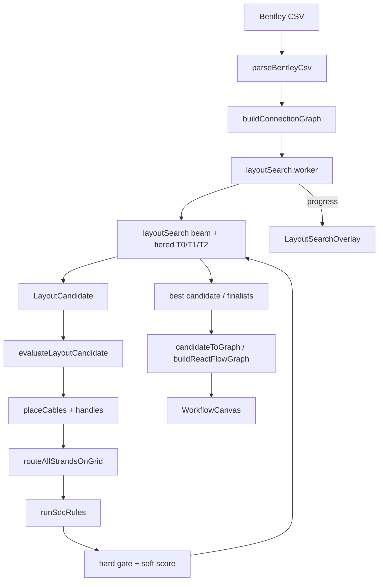

# Routing-first auto layout — reference

> **Status (2026-06-30):** **Shipped.** Auto import picks the best layout via routing-first search; **no 2-side / 4-side user toggle.** Cable edge assignment is a search output [SDC-CORE-001], [SDC-SCORE-001].
>
> **Supersedes for auto placement:** side heuristics in `computeCableCanvasSides`, `computeCanvasPlacement` barycenter flow, and the horizontal vs quad **mode fork** on import. Top/bottom render adapters live in `diagram/quad/` — see [`QUAD_LAYOUT.md`](./QUAD_LAYOUT.md).
>
> **Build history:** phased delivery notes in [`docs/archive/agent/`](../archive/README.md).
>
> **Frozen:** `.cursor/rules/frozen-routing.mdc` — search **calls** routing; does not edit frozen symbols without user approval.

## Product intent

On CSV import, the app runs a long search that:

1. Tries many cable placements (sides, stack order, canvas size).
2. Routes **every fiber strand** on the internal grid.
3. Scores the result against **all SDC rules**.
4. Paints the **best feasible** layout on the canvas.

**No layout mode picker.** Two-sided diagrams are a valid *outcome*, not a user setting. Top/bottom sides are used only when routing score needs them.

**Cable side drag:** `cableSideDrag.ts` updates `optimizedLayoutCandidate` on drag — no full `layoutSearch` rerun (SDC-UX-001).

## Principles

| Principle | Meaning |
|-----------|---------|
| **Routing decides placement** | Cable sides and stack order are search outputs, not upstream heuristics. |
| **Four sides available, none required** | Each cable may land on left, right, top, or bottom; unused edges stay empty. |
| **Rules are hard gates + soft score** | P0/P1 violations reject a candidate; P2–P4 and aesthetics pick among feasible layouts. |
| **Slow is OK on import** | Target 1,000–5,000 candidate evaluations per import (configurable). |
| **Deterministic** | Fixed RNG seed + stable tie-breaks → same CSV → same layout. |
| **Simple splices stay simple** | Soft penalty for using extra sides when scores tie. |

## User vocabulary (simple terms)

See [`SIMPLE_TERMS.md`](./SIMPLE_TERMS.md). Optimizer optimizes:

- **Handle** positions (from cable placement + fiber row pitch).
- **Left leg / right leg** paths and **corners** (bend budget = 2 total).
- **Tube bundle** shared runs and **center nest** stagger.
- **Row order** and **fiber order** inside tubes (fixed by SDC-ORDER; not permuted in search v1).

## Architecture



### Module: `src/features/layoutSearch/`

| File | Role |
|------|------|
| `layoutCandidate.ts` | Per-cable side (L/R/T/B), stack index, `layoutWidth`, `layoutExpansion` |
| `evaluateCandidate.ts` | Build nodes/edges → grid route → rule context → `{ feasible, score, violations }` |
| `layoutSearch.ts` | Beam search, memo, time budget, finalist selection |
| `layoutSearch.worker.ts` | Off-main-thread search + tiered eval |
| `tieredEvaluate.ts` | T0 placement screen → T1 proxy route → T2 full route + rules |
| `candidateToGraph.ts` | Apply winning candidate to placement + React Flow graph |
| `layoutScorer.ts` | Composite soft score + `SDC-SCORE-001` weights |
| `importSearchConfig.ts` | Env flags, time budget, search mode |
| `importDiagnostics.ts` | Dev diagnostics (`VITE_DEBUG_IMPORT_OPTIMIZER=1`) |

**Do not rewrite** `spliceEdgeRouting.ts` frozen symbols. Evaluation calls existing `routeAllOnGrid`, `buildSpliceHandleEntries`, `attachPrecomputedPaths`, and SDC rule runners.

### Unified render path (shipped)

Import is driven by the winning candidate's side assignment:

- Cables on **left/right** — horizontal breakout geometry.
- Cables on **top/bottom** — quad geometry (`orientTubesForQuadSide`, `quadRenderTransform`) as **render adapters** — see [`QUAD_LAYOUT.md`](./QUAD_LAYOUT.md).
- Grid `layoutMode` derived from populated sides (horizontal channel vs quad frontiers — `gridMap.ts`).

`layoutMode` user toggle: **removed from import**; field may remain in saved config for backward compat.

Legacy `buildQuadReactFlowGraph` remains for tests and `.sdc.json` restore paths.

## What each candidate controls

| Knob | Search? | Notes |
|------|---------|-------|
| Per-cable side (L/R/T/B) | **Yes** | Core search dimension |
| Stack order per side | **Yes** | Permute / swap / beam mutations |
| Canvas width | **Yes** | Steps from content min → viewport fill → expanded |
| `layoutExpansion` (center/cable/tube gaps) | **Yes** | Absorbs former `resolveFeasibleImportLayout` loop |
| Row order inside diagram | **No (v1)** | Keep `connectionsInRowLayoutOrder` + dominant pair |
| TIA fiber/tube order inside cable | **No** | SDC-ORDER hard constraint |
| CSV data / pair graph | **No** | SDC-DATA hard constraint |

## Scoring model

Align with [`splice_detail_canvas_rule_pack/00_Rule_Index.md`](../splice_detail_canvas_rule_pack/00_Rule_Index.md) conflict priority section.

### Hard gate — reject candidate (`feasible: false`)

Run full rule set via `buildSdcRuleContext` + `runRules`:

- `SDC-DATA-001`, `SDC-DATA-002`
- `SDC-ORDER-001`, `SDC-ORDER-002`
- `SDC-LAYOUT-001`, `SDC-LAYOUT-002`, `SDC-LAYOUT-003`
- `SDC-GRID-001`
- `SDC-ROUTE-001`, `SDC-ROUTE-002`, `SDC-ROUTE-003`
- SDC-ROUTE-004-A (≤2 bends per strand)

Any `severity: "fail"` → discard (or demote to finalist fallback chain).

### Soft score (minimize among feasible)

| Term | Weight (initial) | Source |
|------|------------------|--------|
| Strand crossings | High | Grid route / lane overlap |
| One-corner bend | Medium | Per strand with exactly 1 corner |
| Two-corner bend | High | Per strand at 2-corner budget (still legal) |
| Single-bend top/bottom credit | Medium | Subtracted per 1-corner strand with T/B endpoint |
| Same-side loopback paths | High | Candidate side pairs + quad router |
| Top/bottom placement relief | dynamic | Crossing/loopback delta vs L/R-only baseline |
| Center width used | Low | Prefer compact |
| Side height imbalance | Low | `layoutScorer` terms |
| Path length | Low | Grid route segment sum |

Top/bottom canvas sides are **not** penalized via `sidesUsed`. Reward cleaner routing (fewer bends, fewer crossings/loopbacks) instead.

Document composite as **`SDC-SCORE-001`** in rule pack. Tie-break: stable candidate id.

## Search strategy

### Config (import-time)

```ts
{
  maxRounds: 2000,
  bruteForceMaxCables: 8,
  seed: hash(reportKey),
  timeBudgetMs: importTimeBudgetMs(strandCount),
}
```

### Algorithm (shipped)

1. **Heuristic paint** — baseline candidate on canvas immediately.
2. **Worker search** — beam search with T0 → T1 → T2 tiered evaluation.
3. **Finalists** — ranked candidates; first full-rule-passing winner selected.
4. **Fallback** — heuristic or best-so-far with diagnostics banner.
5. **Return best-so-far** on cancel/time budget.

Env overrides: see [`TESTING.md`](./TESTING.md) (`VITE_DEBUG_IMPORT_OPTIMIZER`, `VITE_USE_HEURISTIC_IMPORT`, `VITE_DISABLE_OPTIMIZED_IMPORT`).

## Import UX (shipped)

- **“Optimizing layout…”** overlay with phase labels, eval count, elapsed time.
- **Cancel** → apply best-so-far.
- Winning `LayoutCandidate` in layout overrides (`optimizedLayoutCandidate`).
- Failed search → rule failure list + optional heuristic fallback with warning.

## Delivery status

| Phase | Scope | Status |
|-------|-------|--------|
| 1 | Evaluation harness (L/R) | ✅ Shipped |
| 2 | Search engine + determinism | ✅ Shipped |
| 3 | Four-side candidates + quad eval | ✅ Shipped |
| 4 | Import wire + unified render | ✅ Shipped |
| 5 | Rule hardening (`test:rules` on reference set) | ⏸ Suspended — user opt-in |
| 6 | Cable side drag | ✅ Shipped (`cableSideDrag.ts`) |

## Retired on import

| Former | Now |
|--------|-----|
| `computeCableCanvasSides` on import | Search seed only |
| `computeCanvasPlacement` barycenter | Search seed only |
| `resolveFeasibleImportLayout` width loop | Candidate `layoutWidth` / `layoutExpansion` |
| `layoutMode` user toggle | Removed |
| Separate quad import fork | Unified `candidateToGraph` |

Heuristic fallback: `VITE_USE_HEURISTIC_IMPORT=1`.

## Related docs

| Doc | Role |
|-----|------|
| [`QUAD_LAYOUT.md`](./QUAD_LAYOUT.md) | Top/bottom geometry when optimizer picks T/B |
| [`TESTING.md`](./TESTING.md) | Gates, manual QA, import diagnostics |
| [`KNOWN_ISSUES.md`](./KNOWN_ISSUES.md) | Deferred hardening (KI-003 SPI) |
| [`docs/archive/agent/`](../archive/README.md) | Historical build plans |

## Risks and guardrails

| Risk | Mitigation |
|------|------------|
| Import time on large CSVs | Worker, tiered eval, time budget, progress UI |
| Frozen routing drift | Search calls frozen APIs only |
| Non-determinism | Fixed seed; stable tie-breaks |
| No feasible layout | Finalist chain + diagnostics + heuristic fallback |
| Quad geometry bugs | Isolated in `diagram/quad/`; see [`QUAD_LAYOUT.md`](./QUAD_LAYOUT.md) |
