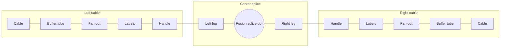

# Simple terms — user ↔ agent dictionary

> **Canonical user vocabulary — all agents must follow.**  
> Cursor rule: `.cursor/rules/simple-terms.mdc` (`alwaysApply: true`).  
> **For the user:** speak using the names on the one-line diagram below.  
> **For agents:** map each simple term to the official/code names before editing layout or routing.
Full detail: [`CANVAS_GLOSSARY.md`](./CANVAS_GLOSSARY.md) · Rule IDs: [`RULE_DICTIONARY.md`](./RULE_DICTIONARY.md)

---

## One-line diagram (left → right)

**Cable → buffer tube → fan-out → labels → handle → left leg → fusion splice dot → right leg → handle → labels → fan-out → buffer tube → cable**

**Three parts:** left cable · center splice (dot + two legs) · right cable (mirror of left).

Read each **cable** outside → in: cable → buffer tube → fan-out → labels → handle.

---

## Dictionary — simple term → what agents use

| You say | What it is (plain) | Agent / code names | Rules (when relevant) |
|---------|-------------------|--------------------|------------------------|
| **Cable** | Round body + cable name on the outside edge | **Cable node**; **cable sheath**; **SMFO label**; **cable name**; optional **cable stub** | **SDC-LAYOUT-001** |
| **Buffer tube** | Thick colored line from cable toward the fan | **Buffer tube** / **tube stem**; **tube origin** (sheath end); **tube tip** (fan end); **tube label** at junction (e.g. BR) | **SDC-LAYOUT-002**, **SDC-ORDER-001** |
| **Fan-out** | Curved thin lines from tube to each fiber row | **Fan legs** (**fan tail** + **fan top**); **fan junction** / **fan-out origin**; **fan zone** | **SDC-LAYOUT-002** |
| **Labels** | Square + letters + circuit text on each row | **Fiber label column**; **fiber swatch**; **fiber code** (SL, WH…); **circuit tag** `(CH 2004)` | **SDC-LAYOUT-002**, **SDC-ORDER-002** |
| **Handle** | Colored dot where the splice path attaches; all handles on one side line up in one **handle column** | **Fiber handle**; **stem column** (`stemX`); fixed **handle column** at max label width | **SDC-LAYOUT-002** |
| **Left leg** | Colored path from left **handle** to the dot | **Left leg**; `leftPath`; source-side color; **source handle** on left cable | **SDC-ROUTE-004**, **SDC-UX-001** |
| **Fusion splice dot** | Black dot where the two legs meet | **Fusion splice dot** / **fusion splice point**; `spliceX`, `spliceY` | **SDC-UX-001** |
| **Right leg** | Colored path from the dot to right **handle** | **Right leg**; `rightPath`; target-side color; **target handle** on right cable | **SDC-ROUTE-004** |

### Left vs right cable (same words, mirrored)

| Side | Handle role | Leg color |
|------|-------------|-----------|
| Left cable | **Source handle** | **Left leg** uses source fiber color |
| Right cable | **Target handle** | **Right leg** uses target fiber color |

---

## Corners (90° bends on the legs)

A **corner** is a 90° turn on the **left leg** or **right leg** (horizontal ↔ vertical).

| You say | Meaning |
|---------|---------|
| **Corner on the left leg** | One 90° bend on the path from handle → dot |
| **Corner on the right leg** | One 90° bend on the path from dot → handle |
| **Straight leg** | That leg has **no corners** (one straight run) |
| **Bend budget** | **2 corners total** for that splice — **left + right combined** | **SDC-ROUTE-004** |

**Important:** The limit is **not** 2 per leg. Count both legs together.

| Split (left + right) | Plain English | OK? |
|----------------------|---------------|-----|
| 0 + 0 | Both legs straight | ✓ |
| 1 + 0 | One corner on the **left leg** only | ✓ |
| 0 + 1 | One corner on the **right leg** only | ✓ |
| 1 + 1 | One corner each leg | ✓ |
| 2 + 0 | Both corners on the **left leg** | ✓ |
| 0 + 2 | Both corners on the **right leg** | ✓ |
| 2 + 1 (or any sum **> 2**) | Over budget | ✗ **SDC-ROUTE-004** |

**Example phrases:**

- “This splice uses **2 corners on the right leg**, **none on the left**.”
- “**Bend budget** is used up — can’t add a corner on the left.”
- “Make both legs **straight** (0 + 0).”
- “**One corner on the left leg** before the dot.”

| You say | Agent / code |
|---------|--------------|
| Corner / bend | **Bend**; `countOrthogonalBends(leftPath, rightPath)` |
| Bend budget | **SDC-ROUTE-004**; `MAX_SPLICE_BENDS = 2` |
| Straight splice | 0 bends; rows aligned within ~12px |

Fan-out curves on the **cable** side are **not** splice corners — only turns on **left leg** / **right leg** count toward the budget.

---

## Routing box (center zone)

The **routing box** is the open middle where **left leg** and **right leg** paths may travel — not over cables, fan-outs, or labels.

| You say | What it is | Agent / code |
|---------|------------|--------------|
| **Routing box** / **center zone** | Valid area for splice legs between fan-outs | **SDC-ROUTE-001**; `routingZone` on grid |
| **Two-sided box** | Only left/right cables — box height = top→bottom fiber on those sides | Horizontal layout mode zone |
| **Four-sided box** | Top/bottom cables too — box height = inner edge of top band to inner edge of bottom band | Quad frontiers; **SDC-ROUTE-001** Case B |

**Example phrases:**

- “That strand went **above the routing box** and looped back down.”
- “Keep routes **inside the center zone** — not over the circuit labels.”

See **SDC-ROUTE-004** for corner count inside the box; **SDC-ROUTE-003** for overlap inside the box.

---

## Tube bundle & center nest

When several fibers from the **same buffer tube** go to the **same target cable**, they travel together in the center before peeling off to their handles.

| You say | What it is | Agent / code |
|---------|------------|--------------|
| **Tube bundle** | Same-tube fibers grouped toward one target cable | **SDC-ROUTE-002**; `tubeBundleKey`; **bundle trunk** |
| **Shared run** | One horizontal they share before splitting | **SDC-ROUTE-002**; **jogX** |
| **Center nest** | Bundled lines turn at staggered positions so they don’t stack | **SDC-ROUTE-002**, **SDC-ROUTE-003** |
| **Peel off** | Each fiber leaves the bundle to its own **center lane** | Distinct **midX** per strand |

**Example phrases:**

- “Keep this **tube bundle** nested — top fiber corners **outside**.”
- “Fibers from BR tube should **share a run** then **peel off**.”
- “**Center nest** is crossing — stagger the corners.”

---

## Stack order (fibers & tubes)

Vertical order on the cable and in the diagram — **not** the same as left/right legs.

| You say | What it is | Agent / code | Rule |
|---------|------------|--------------|------|
| **Fiber order** | Top→bottom order of fibers **inside one buffer tube** (TIA colors) | **TIA fiber order**; fiber #1 at top | **SDC-ORDER-002-A** |
| **Tube order** | Top→bottom order of **buffer tubes** on the cable (BL…AQ, then striped) | **TIA tube order** | **SDC-ORDER-001-A** |
| **Row order** | Top→bottom order of **splice rows** on the full diagram | Global row layout; CSV + tube grouping | **SDC-LAYOUT-001-E**, **SDC-LAYOUT-001-F** |
| **24px spacing** | Distance between neighboring fiber rows in a tube | **Row pitch** | **SDC-ORDER-002-B** |

**Example phrases:**

- “**Fiber order** in the BR tube is wrong — WH should be above RD.”
- “**Tube order** on the left cable — OR tube should be below BL.”
- “Preserve **row order** when nesting the **center bundle**.”

**Center nest** follows **row order** / **fiber order**: which line corners first depends on which row is higher on the diagram (**SDC-ROUTE-002**).

---

## When you need more precision (agent-only)

You usually don’t need these in chat — agents reach for them when fixing routing or layout:

| You might say… | Agent translates to… |
|----------------|---------------------|
| “Two corners on the right, none on the left” | 2 + 0 bend split; **SDC-ROUTE-004-A** budget |
| “Over the bend budget” | `bendCount > 2`; **SDC-ROUTE-004-A** |
| “The line bends too much in the middle” | Too many **corners** on legs; widen **midX** lanes instead |
| “Vertical lines in the center overlap” | **Center lane** / **midX**; **SDC-ROUTE-003**, **SDC-ROUTE-003-A** |
| “Same-tube fibers should share a horizontal” | **Tube bundle** / **shared run** / **jogX**; **SDC-ROUTE-002** |
| “Bundle nest is wrong” | **Center nest**; **SDC-ROUTE-002**, **SDC-ROUTE-003** |
| “Fiber order wrong in the tube” | **Fiber order**; **SDC-ORDER-002-A** |
| “Tube order wrong on the cable” | **Tube order**; **SDC-ORDER-001-A** |
| “Line doesn’t clear the circuit text” | **Gap horizontals**; **OS / circuit column**; **SDC-ROUTE-001** |
| “Dots from one tube should line up” | **Dot column**; **SDC-UX-001-C** |
| “Dot too close to a corner” | **48px corner clearance**; **SDC-UX-001-D** |

---

## Manual adjust (toolbar toggle)

Turn **Manual adjust** on when you want to nudge fan-out/labels and leg segments without auto relayout.

| You say | What it is | Agent / code |
|---------|------------|--------------|
| **Manual adjust** | Off = auto layout + routing; on = cable drag moves position only | `autoAdjustEnabled`; `useManualAdjustEngine` |
| **Handle column** | Every handle on left (or right) lines up vertically; fiber codes sit in the column just left of handles | `fixedHandleOutsetFromStem`; `fiberRowLayoutXs`; fan strand fills gap to label |
| **Fan-out drag** | Drag a buffer tube’s fan-out + labels **up/down** only | `fanoutOverrides`; buffer tube stretches (`visualShiftY`) |
| **Leg segment** | One straight run between two **corners** on a leg | `legSegments.ts`; segment overlay handles |
| **Multi-select** | Shift+click splices or box-select several rows | `selection.ts`; fiber anchor nodes |
| **Corner clearance** | Fusion dot must stay **48px** from any leg corner | **SDC-UX-001-D**; `FUSION_DOT_MIN_CORNER_CLEARANCE` |

**Example phrases:**

- “In **manual adjust**, drag the **fan-out** on the BR tube down.”
- “**Handle column** looks good — now move **segment 2** on the left leg.”
- “**Multi-select** these three rows and drag together.”
- “**Dot** is too close to a **corner** — need more **corner clearance**.”

---

## How to use in chat

| You say | Agent should think |
|---------|-------------------|
| “Move the **buffer tube** on the left” | Tube stem / tip geometry, `CableNode`, `cableBreakoutGeometry` |
| “**Fan-out** looks wrong on BR tube” | Fan legs, `fanFrom` / `fanTo`, tube label BR |
| “**Labels** overlap” | Fiber label column, `stemX`, SDC-LAYOUT-002-F |
| “**Handle** doesn’t line up with the **right leg**” | Fiber handle Y, splice edge target end, `rightPath` |
| “**Left leg** crosses the **fusion splice dot**” | Demarcated paths, `buildDemarcatedSplicePaths`, SDC-UX-001-B |
| “**2 corners on the right leg**, straight **left leg**” | 0 + 2 bend split; `rightPath` geometry |
| “**Tube bundle** nest — top row outside” | **Center nest**, SDC-ROUTE-002/007 |
| “**Fiber order** off in BR tube” | SDC-ORDER-002-A, `tubeFiberLayout` |

---

## See also

- [`CANVAS_GLOSSARY.md`](./CANVAS_GLOSSARY.md) — expanded part names + screenshots
- [`RULE_DICTIONARY.md`](./RULE_DICTIONARY.md) — layout rule IDs (SDC-LAYOUT-002-A, SDC-ROUTE-004-A, …)
