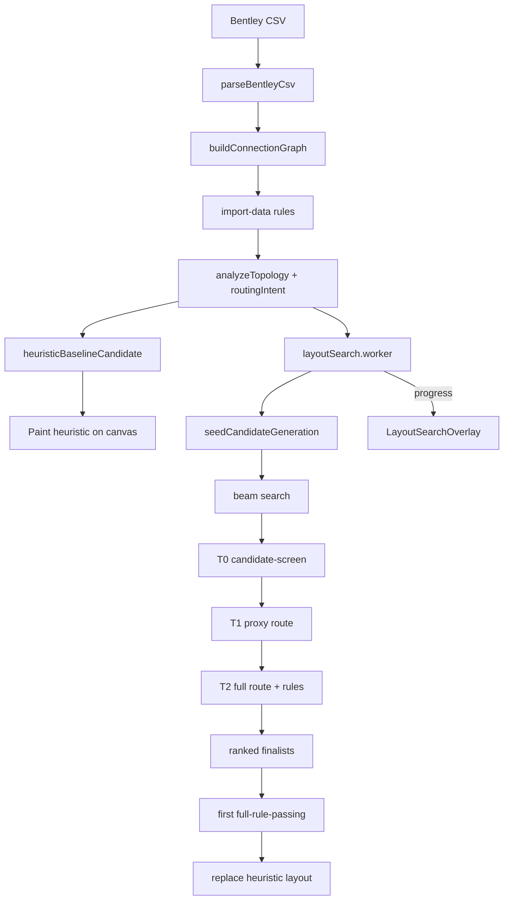

# Import optimizer — one-pass build plan

> **Archived (2026-06-30).** Moved from `docs/agent/`. **Shipped 2026-06-28** (beam search, four-side scoring, finalist fallback, diagnostics). Live reference: [`ROUTING_FIRST_LAYOUT.md`](../../agent/ROUTING_FIRST_LAYOUT.md).

## Goal

Deliver a **fast, four-side-aware, rule-driven** CSV import optimizer that:

1. Paints a heuristic layout immediately (no blank/frozen canvas).
2. Searches LEFT / RIGHT / TOP / BOTTOM placements when routing benefits.
3. Uses **staged evaluation** (cheap screen → proxy route → full route + rules).
4. Applies the **best full-rule-passing** layout (finalist fallback, not heuristic-only).
5. Finishes typical CSVs in seconds–tens of seconds; hard fixtures fail gracefully with diagnostics.

**Frontend only. No new npm deps. Do not edit frozen routing symbols** (`.cursor/rules/frozen-routing.mdc`).

---

## What is already shipped (do not remove)

| Area | Location |
|------|----------|
| Web Worker search | `layoutSearch.worker.ts`, `layoutSearchClient.ts` |
| Heuristic-first paint | `WorkflowCanvas.tsx` |
| Progress overlay | `LayoutSearchOverlay.tsx` |
| Topology analysis + locks | `topology/analyzeTopology.ts`, `deriveConstraints.ts` |
| Tiered T0 / T1 / T2 | `tieredEvaluate.ts` |
| Score memo + time budget | `layoutSearch.ts`, `importSearchConfig.ts` |
| Skip duplicate final T2 | `LayoutSearchResult.winnerEvaluation` |
| Heuristic fallback | `VITE_USE_HEURISTIC_IMPORT=1`, `VITE_DISABLE_OPTIMIZED_IMPORT=1` |

---

## Confirmed bugs to fix

| Bug | File | Fix |
|-----|------|-----|
| Same-side loopbacks use `centerX` X-coord only | `layoutScorer.ts` | Classify by **candidate cable sides**, not route geometry |
| T0 crossing estimate is L/R only | `tieredEvaluate.ts` | Four-side cheap crossing + side-pair penalty |
| T0 flat penalty for top/bottom | `tieredEvaluate.ts` | Conditional benefit when top/bottom reduces loopback/crossing risk |
| Topology `sameSideRate` uses CSV L/R | `analyzeTopology.ts` | Keep for seed hints; candidate screen uses candidate sides |
| `heightImbalance` ignores top/bottom | `layoutScorer.ts` | Balance across all populated sides (or drop term when quad) |
| Best soft-score fails rules → heuristic only | `WorkflowCanvas.tsx` | Try ranked **finalists** before heuristic fallback |
| T2 promotes too many (`bestScore * 1.25`) | `tieredEvaluate.ts` | Top-K finalists only (see caps below) |
| T1 builds full graph then filters edges | `tieredEvaluate.ts` | Lightweight proxy context (Phase E) |

`toGraphCableSide` (top/bottom → left for `graph.cableSides`) is an **intentional bridge** — keep it, but scoring/rules for candidates must read `candidate.cableSides` / `quadCableSides`, not the proxy.

---

## Architecture (target)

---

## Implementation phases (single pass — execute in order)

### Phase 1 — Diagnostics + forced sides

**Purpose:** Prove top/bottom can generate, score, promote, render before rewriting search.

| Task | Detail |
|------|--------|
| `LayoutSearchDiagnostics` | Add to `layoutSearchTypes.ts`; populate in `layoutSearch.ts` |
| Counters | `topGenerated`, `bottomGenerated`, `topOrBottomReachedT1/T2`, `evaluatedT0/T1/T2`, `rejectedByRule` |
| `finalistSummaries` | Ranked list with sides used, score, feasible, failed rule IDs |
| `selectedCandidateReason` | Human string: e.g. "top relief reduced loopbacks" |
| Env: `VITE_FORCE_LAYOUT_SIDES` | Parse `"CableA:top,CableB:right"` in `importSearchConfig.ts`; inject seed candidate |
| Env: `VITE_LAYOUT_SEARCH_MODE` | `beam` (default after this build) \| `legacy-guided` |
| Debug | When `VITE_DEBUG_LAYOUT_SEARCH=1`: `console.table(finalistSummaries)` |
| Extend overlay | Optional diagnostics row in `LayoutSearchOverlay.tsx` (dev only) |

**Gate:** Forced top/bottom fixture renders quad layout; diagnostics show top/bottom candidates evaluated.

---

### Phase 2 — Four-side scoring correctness

**Purpose:** Top/bottom candidates must compete fairly in T0–T2 soft score.

| Task | Detail |
|------|--------|
| `getConnectionEndpointSides` | New in `layoutScorer.ts` or `layoutCandidate.ts`: `(candidate, graph, connection) → { sideA, sideB }` |
| `sidePairKind` | `same` \| `opposite` \| `adjacent` for L/R/T/B pairs |
| `countSameSideLoopbacks` | Rewrite: count connections where both endpoints share candidate side |
| `sidePairRoutingPenalty` | Cheap T0/T1 term from side-pair kinds × connection weights |
| `fourSideCrossingEstimate` | Extend T0 beyond `stackOrderCrossingCount(left, right)` — estimate all side-pair crossings |
| `topBottomBenefit` | Reward only when moving cable to T/B reduces loopback/crossing estimate vs L/R-only baseline |
| `heightImbalance` | For quad candidates: compare populated side stack depths fairly |
| Keep tie-break | Fewer sides when scores tie (`compareCandidates`) |

**Files:** `layoutScorer.ts`, `tieredEvaluate.ts` (T0), `layoutScorer.test.ts` (new).

**Gate:** Synthetic tests (see Testing) pass; simple 2-cable splice still prefers L/R when T/B doesn't help.

---

### Phase 3 — Routing intent + strong seeds

**Purpose:** Fewer, better starting candidates. **Extend** `analyzeTopology.ts`, do not duplicate.

| Task | Detail |
|------|--------|
| `routingIntent.ts` | Export `RoutingIntent` derived from `TopologyAnalysis` + graph stats |
| Fields | `dominantPairs`, `satelliteToAnchor`, `medianRowByCablePair`, `sameSideRiskPairs`, `topBottomReliefCandidates`, `bundleGroups` |
| `seedCandidateGeneration.ts` | `generateSeedCandidates(graph, intent, constraints) → LayoutCandidate[]` (8–30) |
| Seed types | Heuristic baseline; dominant pair L/R, R/L, T/B, B/T; hub + distributed satellites; balanced four-side; stack sorted by median row; loopback-relief T/B; simple two-sided |
| Wire into search | `layoutSearch.ts` runs beam from seeds instead of random restarts only |
| Deterministic | Stable sort + fixed seed from `reportStorageKey` |

**Gate:** Seeds include T/B when `topBottomReliefCandidates` non-empty; simple fixtures get ≤2 sides in seeds.

---

### Phase 4 — Beam search + finalist validation

**Purpose:** Replace wasteful random guided search with structured beam; guarantee rule-valid winner.

| Task | Detail |
|------|--------|
| `runBeamSearch` | New in `layoutSearch.ts` (keep `runGuidedSearch` behind `legacy-guided`) |
| Beam flow | T0 all seeds → keep top 8–12 → expand mutations per beam slot → T0 again → repeat depth 3–5 |
| Mutations | Flip one cable side; move loopback-heavy cable to T/B; swap stack neighbors; sort stack by median row; width ±1; expansion ±1 |
| T1 | Top 20–30 after beam |
| T2 | Top **3–8** finalists only — remove `t2PromoteFactor` broad promotion |
| Caps | T0 ≤ 300, T1 ≤ 40, T2 ≤ 8 (tune in `importSearchConfig.ts`) |
| `LayoutSearchResult` | Add `finalists: RankedCandidate[]`, `diagnostics?: LayoutSearchDiagnostics` |
| Finalist pick | `pickBestPassingFinalist(finalists)` — first with `feasible: true` at T2 |
| `WorkflowCanvas.tsx` | Use finalist picker; only heuristic fallback if **no** finalist passes |
| Worker | Serialize new result fields in `layoutSearch.worker.ts` |

**Gate:** Finalist fallback test; beam mode default; `legacy-guided` still works via env.

---

### Phase 5 — Proxy route optimization

**Purpose:** Cut T1 wall time without weakening T2.

| Task | Detail |
|------|--------|
| `buildProxyEvalContext` | New helper in `tieredEvaluate.ts` or `proxyRouteContext.ts` |
| Avoid | Full `buildReactFlowGraph` + filter when proxy strand count ≪ total |
| Build | Minimal nodes for cable anchors + representative splice edges only |
| Representatives | One per `proxyBundleGroups`; one per cable-pair; one per high-risk same-side pair |
| Cache | `proxyRouteKey` memo alongside `candidateStableId` |
| T2 unchanged | Full `evaluateLayoutCandidate` on finalists only |

**Frozen constraint:** Call `routeAllOnGrid`, `buildSpliceHandleEntries`, etc. — do not edit frozen symbols in `spliceEdgeRouting.ts` / `WorkflowCanvas.tsx` drag hooks.

**Gate:** T1 wall time drops on STATE_OFFICE probe; final layout quality unchanged on example-2 + Left-SP.

---

### Phase 6 — Tiered rule screening (lightweight)

**Purpose:** Formalize cheap vs full rule runs without full registry rewrite.

| Task | Detail |
|------|--------|
| `runRulesForTier` | New in `runRules.ts`: `"import-data"` \| `"candidate-screen"` \| `"proxy-route"` \| `"final-layout"` |
| Mapping | `import-data`: DATA + ORDER; `candidate-screen`: + LAYOUT cheap checks; `proxy-route`: + ROUTE approximations; `final-layout`: all rules (current `runRules`) |
| Implementation | Filter `SDC_RULES` by optional `rule.tiers?: RuleRunMode[]` on each rule — add field to `types.ts`, default `["final-layout"]` for all existing rules; tag rules that can run early |
| T0/T1 | Call `runRulesForTier` with appropriate context (graph-only where possible) |
| T2 | Full `runRules` unchanged |

Do **not** weaken any `severity: "fail"` on final-layout tier.

---

## Performance targets

| Fixture | Target (worker path) |
|---------|----------------------|
| example-2 | < 5 s |
| Left-SP-3254.5 | < 15 s |
| Left-STATE_OFFICE | < 60 s (down from ~2 min) |
| Left-SPI-215 (KI-003) | Time budget + graceful fallback + diagnostics |

Always: no main-thread long tasks; overlay heartbeat honest; deterministic (same CSV + seed → same layout).

---

## Testing (add in one pass)

| Test | File |
|------|------|
| Four-side side detection | `layoutScorer.test.ts` |
| Same-side loopback (L-L, T-T, adjacent not same) | `layoutScorer.test.ts` |
| Top/bottom wins synthetic fixture | `layoutSearch.test.ts` |
| Simple splice prefers L/R | `layoutSearch.test.ts` |
| Finalist fallback (best fails, #2 passes) | `layoutSearch.test.ts` |
| Determinism (beam mode) | `layoutSearch.test.ts` |
| Forced sides env | `importSearchConfig.test.ts` or `layoutSearch.test.ts` |
| Seed generation deterministic | `seedCandidateGeneration.test.ts` |
| Perf probe (STATE improved; SPI may skip) | `importPerfProbe.test.ts` |

**Default gate:** `npm run smoke`  
**Do not run** `npm run test:rules` unless user asks.

---

## Manual QA (after implementation)

Import via dev fixtures:

| CSV | URL |
|-----|-----|
| example-2 | default / reference |
| Left-SP-3254.5 | `?fixture=sp` |
| Left-STATE_OFFICE | `?fixture=state` |
| Left-SPI-215 | `?fixture=spi` |

Checklist per fixture:

- Heuristic visible quickly
- Overlay shows progress + phase
- Final layout applied or fallback banner explains why
- Diagnostics (dev) show whether T/B candidates were tried
- No unexpected SDC hard-rule weakening

---

## Files to touch (expected)

| File | Change |
|------|--------|
| `src/features/layoutSearch/layoutScorer.ts` | Four-side scoring |
| `src/features/layoutSearch/layoutScorer.test.ts` | **New** |
| `src/features/layoutSearch/tieredEvaluate.ts` | T0 four-side, T2 caps, proxy context |
| `src/features/layoutSearch/routingIntent.ts` | **New** |
| `src/features/layoutSearch/seedCandidateGeneration.ts` | **New** |
| `src/features/layoutSearch/seedCandidateGeneration.test.ts` | **New** |
| `src/features/layoutSearch/layoutSearch.ts` | Beam search, diagnostics, finalists |
| `src/features/layoutSearch/layoutSearchTypes.ts` | Diagnostics types |
| `src/features/layoutSearch/layoutSearch.worker.ts` | Result serialization |
| `src/features/layoutSearch/importSearchConfig.ts` | Env flags, caps |
| `src/features/layoutSearch/topology/analyzeTopology.ts` | Export stats for intent |
| `src/features/rules/types.ts` | Optional `tiers` on rules |
| `src/features/rules/runRules.ts` | `runRulesForTier` |
| `src/features/canvas/WorkflowCanvas.tsx` | Finalist picker |
| `src/features/canvas/LayoutSearchOverlay.tsx` | Optional diagnostics |
| `docs/agent/CONTEXT.md` | Update focus |
| `docs/agent/HANDOFF.md` | Session results |

**Do not edit** frozen routing files without explicit user approval.

---

## Env flags (summary)

| Flag | Purpose |
|------|---------|
| `VITE_LAYOUT_SEARCH_MODE=beam` | Default structured search |
| `VITE_LAYOUT_SEARCH_MODE=legacy-guided` | Old hill-climb |
| `VITE_FORCE_LAYOUT_SIDES=CableA:top,CableB:right` | Debug forced placement |
| `VITE_DEBUG_LAYOUT_SEARCH=1` | Console diagnostics |
| `VITE_DEBUG_IMPORT_CANDIDATES=1` | Candidate detail logs |
| `VITE_DISABLE_OPTIMIZED_IMPORT=1` | Skip search |
| `VITE_USE_HEURISTIC_IMPORT=1` | Heuristic layout path (skip optimizer) |

---

## Out of scope (this build)

- P4 worker pool (optional follow-up)
- `npm run test:rules` / full hardening gate
- KI-003 full feasibility (SPI-215 always feasible) — document timeout fallback only
- Frozen splice routing edits
- New npm dependencies
- Manual cable drag to any side (SDC-UX-001)

---

## Acceptance criteria

- [ ] Beam search is default; legacy mode available
- [ ] Four-side scoring uses candidate sides, not centerX
- [ ] Top/bottom can win on synthetic fixture when it improves routing
- [ ] Finalist fallback selects rule-passing #2 when #1 fails
- [ ] Diagnostics explain winner and T/B candidacy
- [ ] `npm run smoke` passes
- [ ] Manual QA on example-2 + 3 Left fixtures documented in HANDOFF
- [ ] CONTEXT + HANDOFF updated

---

## References

- [`ROUTING_FIRST_LAYOUT.md`](../../agent/ROUTING_FIRST_LAYOUT.md) — product intent, scoring weights
- [`IMPORT_PERF_PLAN.md`](./IMPORT_PERF_PLAN.md) — P0–P3 shipped architecture
- [`IMPORT_FINISH_PLAN.md`](./IMPORT_FINISH_PLAN.md) — prior one-pass checklist
- [`splice_detail_canvas_rule_pack/00_Rule_Index.md`](../../../splice_detail_canvas_rule_pack/00_Rule_Index.md) — conflict priority
- [`SIMPLE_TERMS.md`](../../agent/SIMPLE_TERMS.md) — user vocabulary
